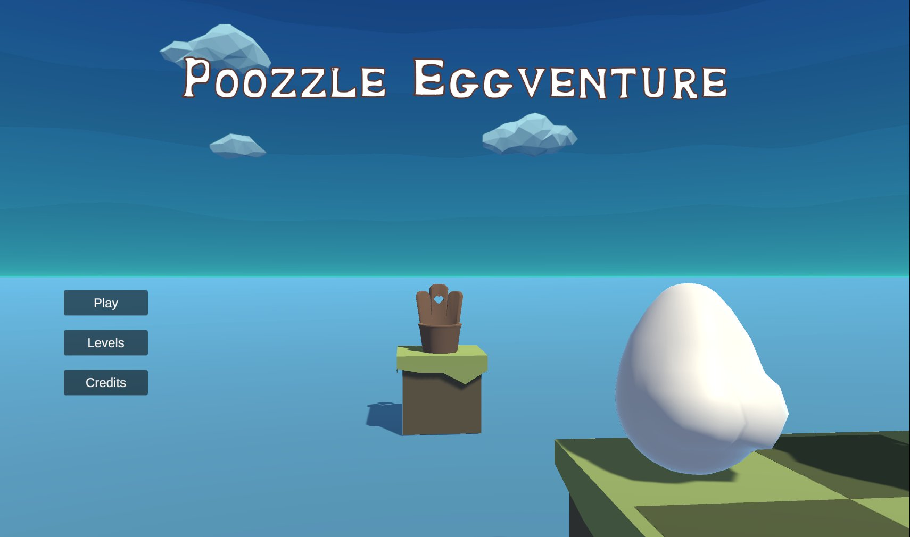

# Poozzle Eggventure


Welcome to Poozle Eggventure, a humorous and quirky game where an egg embarks on a comical journey to make it to the toilet on time! Will they succeed, or will hilarity ensue?

A game by a group of students for Unity game making course - NAVPH. 



## Gameplay

The objective of the game is to guide your egg through each level and ensure it reaches the toilet before time runs out. If your egg doesn't make it in time, well, let's just say there might be a surprise waiting!

## Features

- Playful and quirky levels
- Humorous challenge
- Turn-based gameplay
- Special power-ups and portals
- Different level settings

## Getting Started

1. Clone the repository:

   ```bash
   git clone https://github.com/Salgac/PoozleEggventure.git
   ```

2. Open the project in Unity.

3. Playtest and enjoy the eggciting adventure!

## Dependencies

- Unity 2022.3.11f1

## Releases

- Windows:  [Poozle_Eggventure.exe](https://www.dropbox.com/scl/fi/jd82k8i2ti5l49j9a4w8r/Poozzle_Eggventure.exe?rlkey=vrnrrce9jwtsft46gx5acdppx&dl=0)
- Mac:  [PoozleEggventure_v1.app](https://www.dropbox.com/scl/fo/zp0h0wc123qrsvczttgom/h?rlkey=hmeals7cizo34k81rdhj6odjo&dl=0)

Video Showcase: [Youtube](https://youtu.be/RRZzyczjr-M)

## License

This project is licensed under the [MIT License](LICENSE).

## Acknowledgments

- Eggcellent contributors:
  - [Dominik Šalgovič](https://github.com/Salgac) - Programming and level design
  - [Patrik Lukáčik](https://github.com/Palapuk) - Programming and level design
  - [Samuel Bučák](https://github.com/samuelbucak) - Programming and level design
  - [Sofiia Popysheva](https://github.com/akirakim03) - Art
  - Juraj Gabčík - Art
- Inspiration from the world of pooping eggs
- Eggsternal sources:
  - Audio tracks from [incompetech.com](https://incompetech.com/music/royalty-free/music.html):
    - "Joey's Formal Waltz - Scented" by Kevin MacLeod
    - "Obliteration" by Kevin MacLeod
    - "Farting Around" by Kevin MacLeod
  - Unity assets and packages:
    - [FancyTextRendering](https://github.com/JimmyCushnie/FancyTextRendering)
    - [Polyverse Skies](https://assetstore.unity.com/packages/vfx/shaders/polyverse-skies-low-poly-skybox-shaders-104017)
    - [Translucent Image](https://assetstore.unity.com/packages/tools/gui/translucent-image-fast-ui-background-blur-78464)
    - [Bubble Font](https://assetstore.unity.com/packages/2d/fonts/bubble-font-free-version-24987)

Happy eggventuring!
